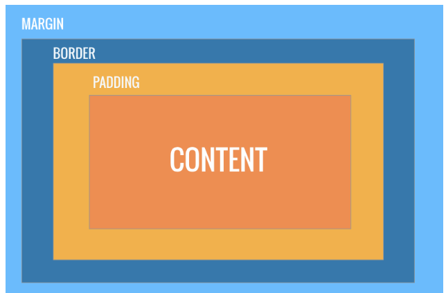
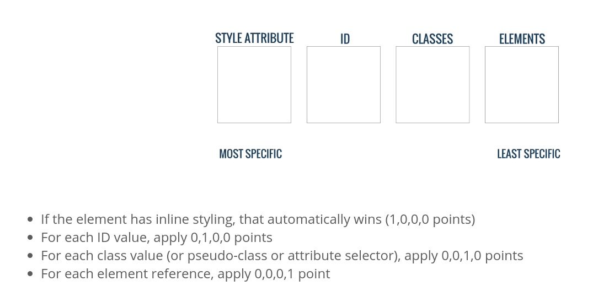

# CSS
## Definition
> CSS stands for Cascading Style Sheet, We can change almost anything, font, colours and layouts

> Its best to write CSS in an external style sheet, we make one by just adding a .css at the end of it

> TO tell the HTML page we are using a style sheet and where to look we use a link tag. The < head> of the HTML document is where we put information that our browser needs in order to render the page properly

```html
<!DOCTYPE html>
<html lang="en">
<head>
  <meta charset="UTF-8">
  <link rel="stylesheet" href="/styles.css">
  <title>My Awesome Web Page</title>
</head>
<body>

</body>
</html>
```

### Link Tag

```html
<link rel="stylesheet" href="/styles.css">
```
> There are two attributes here, rel and href
* rel: relationship between current document and the linked document/resource
* href: the location of the linked document

> We're linking a stylesheet and here is where you can find it

### Anatomy of a CSS block

Three Parts:

1. Selector: Which elements we want to style 
2. Property: What about those elements do we need to change
3. Value: What do we want to change it to 


---
## Selectors, Classes & IDs

> Selectors allow us to pick an element, we can do this using **tags**, **classes** or **id's**

> Below are examples using all 3 methods

### HTML Tags (just put the letter)

```html
<h1> Our Awesome Page </h1>

<p> The first paragraph </p>
<p> The second paragraph </p>
```
#### CSS
>Turns all the paragraph tags purple
```css
p {
  color: purple;
}
```

### Classes (.classname)
> Classes are an example of HTML attributes (little pieces of information we can add to HTML tags).
>  We use classes when we want to share the styles between more than one HTML Tag. One tag can have as many classes as we want, and a class can be used as many times as you'd like on a web page. 

```html
<h1 class="highlight"> My First Blog Post </h1>

<p> The first paragraph of my awesome blog post </p>

<p class="highlight"> The second paragraph </p>
```

#### CSS
see how we use .classname thats syntax for classes
```css
.highlight {
  color: yellow;
}
```

> This code would make the h1 and second paragraph font yellow

### ID's
> When you want to style one unqiue element on the page. Each HTML element can only have one ID, and each ID on your webpage has to be unique. Alerts and notifications are a great example of when you might want to use an ID. 

```HTML
<p id="alert"></p>
```

#### CSS
we use  # for ID's 
```css
#alert {
  background-color: red;
}
```
---

## Fonts
> If we want to use Arial on our webpage, we can select the body tag and the font-family property to change the font of all our element

sans-serif is the fallback in the event that Arial doesn't work

```css
body {
  font-family: Arial, sans-serif
}
```
### Custom Fonts 
We can go to google fonts and grab one from there and they give you a code snippit to add to your code

[Google Fonts](https://fonts.google.com/)


### We can style fonts even further using a variety of different properties


#### Font-style

can be set to: normal, italic, oblique

```css
p {
  font-style: italic;
}
```
#### Font-weight
style without using < strong>. Normal, bold, bolder, lighter, or a number from 100 to 900 (numbers must be multiple of 100)

```css
p {
  font-weight: bold;
}
```

#### Font-size 
using h1-h6 tags can give us different sized fonts, but if you wanna be a bit more specific

```css
.blog-title {
  font-size: 30px;
}
```

#### Text-align
Sets the alignment of the text -left, right center or justify

```css
p {
  text-align: center;
}
```

#### Text-transform
Allows you to make all of our text uppercase or lowercase. Takes the properties: capitalize, uppercase, lowercase

```css
#alert {
  text-transform: uppercase;
}
```

#### Letter-spacing
Sets the space between letters. Can be set to negative numbers

```css
p {
  letter-spacing: 10px;
}
```
---

## Colours 🌈

> List of built in colour names found here
[color list](https://www.w3schools.com/cssref/css_colors.asp)

**Colour is spelt the American way without the U**

```css
h1 {
  color: tomato;
  background-color: blue;
}
```
### Hexadecimal Colours

> You can make any colour by combining red, yellow, and blue. 


> The first two values correspond to the amount of red in the colour, the next two represent the amount of green, and the last two are blue. If all of the values are equal, the color will be a shade of grey

> Something to note though, is that hex colours use 0-9 and a-f as values.

F is the highest, while 0 is the lowest. So, #000000 is black, and #ffffff is white.

---

## Margin and Padding
> We can set the height and width of an element in the units of pixels or percentages

```css 
p {
  width: 100%;
  height: 200px;
}
```

### Margins / Padding / Borders

* Margin sets the distance between two elements
* Padding adds space between an element's content and it's border


> When styling the layout of your page, it helps to picture each element as a picture frame. Each element is made up of a content area, the space surrounding it, known as padding, a border, and then the space that separates one element from the next, the margin



#### Padding

Lets say we have a paragarph tag in our HTML

```html
<p>This is my super awesome paragraph</p>
```

If we want to add some space between our text and the border - we would want to add some padding

```css
p {
  border: 1px solic black;
  padding-top: 10px;
  padding-bottom: 10px;
  padding-left: 10px;
  padding-right: 10px;
}
```

We can write it into one line as well

```css
p {
  border: 1px solid black;
  padding: 10px;
}
```

#### Border
Lets start by adding a border around our paragraph

```css
p {
  border-width: 1px;
  border-color: black;
  border-style: solid;
}
```
> Some CSS properties can take more than once value. Instead of writing them on three lines like above we can shorten this code to 

```CSS
p {
  border: 1px solid black;
}
```

#### Margin

So now we want to move the border of out < p> tag away from the elements that surround it, we would add a margin

```CSS
p {
  border: 1px solid black;
  padding: 10px;
  margin: 10px;
}
```
> Margin can be applied to all sides like border 

---

## Specificity

How does CSS which rule to apply when there are conflicting rules, the answer is **Specificity**

1. Styles written at the bottom of a file will overwrite styles written at the op. 

e.g.

```css
p {
  font-size: 20px;
  color: blue;
}
#alert {
  padding: 10px;
  background-color: red;
}
p {
  color: green;
}
```

In this above example the color of the paragraph tags is declared twice, at the top we set it to blue and at the bottom its green. WHen the page loads the font color will be green.
Cascase: They styles that come last can override styles at the top

Below is a pic explaining the order



Another Example

```html
HTML 
<p class="special" id="alert">This is a paragraph</p>
```
```css
#alert {
  color: red;
}
.special {
  color: orange;
}
```

The color of the paragraph tag will be red, Even though the cascade is there, because the ID has a higher specificity

---

## Positioning

### Display Property
> Every HTML element has a default display property. We have block elements, that will take up the entire width of the page (Think < p>, < div>, < h1>, to name a few).

> Inline elements will only take up as much room as their content needs. Anchor tags, image tags and span tags are all inline elements. You can also set the display property to none.

### The Box Model

> We can change the width and the height of an element using, as you've probably guessed, the width and height properties. Sometimes, an element can appear bigger than what you set it to, the elements border and padding can add width past the one you specified. If we had a paragraph set to width: 30px;, and then we add padding, the width of our element can be larger than 30px. To fix this, we can simply set box-sizing: border-box;. This way, we can set as much margin and padding as we want without worrying about the width of the element.


Using pixels and percentages

```css
p {
  width: 200px;
}

p {
  width: 45%;
}
```
Percentages are better for responsive webpages

### Position

The default position of all HTML Elements is static

* **Relative Elements** behave the exact same as static, uness you add some extra properties. Setting the top, right, bottom, and left properties will allow you to adjust where the element is in the page.

[Example](https://codepen.io/MaggieMoss/pen/OWmrPE)

```css
p {
  border: 1px solid tomato;
  position: relative;
  top: 50px;
  left: 50px;
}
```

* **Fixed Elements** are positioned relative to the viewport (in other words, the browser window). Even if the page is scrolled, an element with a fixed position will always stay in the same place.

[Example](https://codepen.io/MaggieMoss/pen/apWPvZ?editors=1100#0)
```css
.alert {
  position: fixed;
  top: 0;
  right: 0;
  border: 1px solid tomato;
}
```

* **Absolute Elements**  that are positioned absolutely can get pretty tricky. The behave like a fixed element except they position relative to the nearest positioned ancestor. (Any 'positioned' element is simply one that has a position other than static).

[Example](https://codepen.io/MaggieMoss/pen/apWPvZ?editors=1100#0)

```css
main p {
  border: 1px solid tomato;
  position: absolute;
  top: 50px;
  left: 60px;
}
```

### Floats
> Floats let us put two elements next to each other. Let's say we have an aside and a main tag. Both of these elements are block level elements, meaning they take up as much width as they can. If we want them to sit next to each other, one option is to use floats. First, we'll start by wrapping both of our tags in a container like so:

```html
<div class="container">
    <aside></aside>
    <main></main>
  </div>
```

```css
aside {
  width: 30%;
  float: left;
}
And the width of the main tag to 70%.

main {
  width: 70%;
  float: left;
}
```

[Example](https://codepen.io/MaggieMoss/pen/LxyMPb)

---

# Resources

[Start Bootstrap](https://startbootstrap.com/)

[Font Awesome](https://fontawesome.com/)