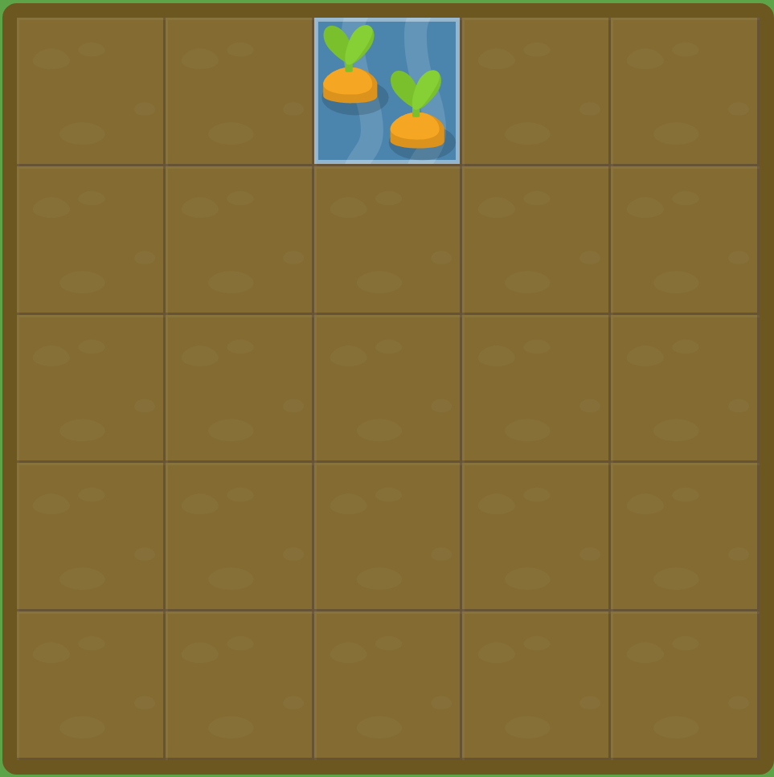
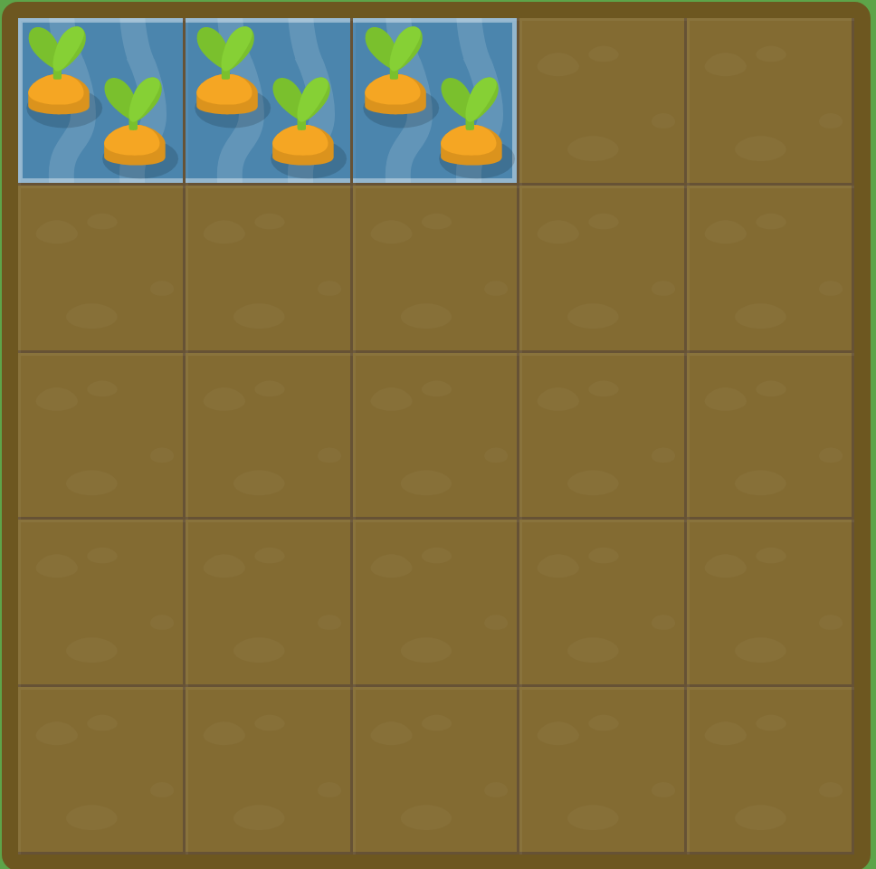
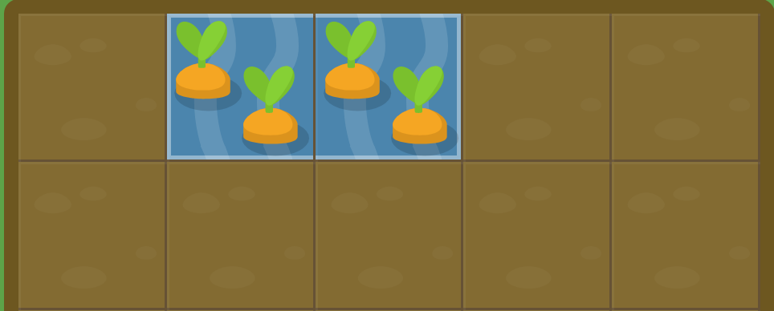
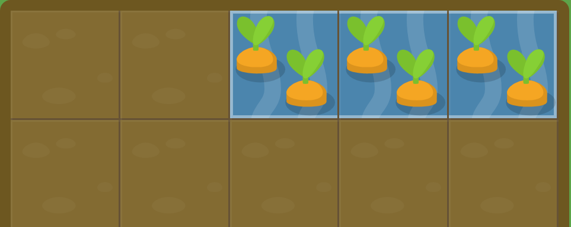

# Grid Box Notes
A simple breakdown of some grid garden


## Columns

``` css
#water {
  grid-column-start: 3;
}
 This means that the water will start at the 3rd vertical grid line, Which is another way of saying the 3rd vertical border from the left of the grid. 
```



You can see above how water started from the 3rd vertical line

``` css
#water {
grid-column-start: 1;
grid-column-end: 4;

}
When grid-column-start is used alone, the grid item by default will span exactly one column. However, you can expand the item across multiple columns by adding the grid-column-end property

grid-column-end will end at the vertical line that you set it to
```



```css
#water {
  grid-column-start: 5;
  grid-column-end: 2;
}

When using start and end, the end value doesn't have to be greater than the start value

```

#### You can also do negatives

If you want to count grid lines from the right instead of the left, you can give grid-column-start and grid-column-end negative values. 

E.g. -1 is the frist grid line from the right

``` css
#water {
  grid-column-start: 1;
  grid-column-end: -3;
}

look above and from the farthest right thats -1 then count two more and thats -3 
```


#### Anotehr example

``` css 
#water {
  grid-column-start: -3
}
It still goes from left to right rmr that
```


### Span

Instead of defining a grid item bated on the start and end positions of the grid lines, we can define it based on the desired column width using the span keyword. **only works with positive values**


``` css 
#water {
  grid-column-start: 2;
  grid-column-end: span 2;
}
```



You can also set the span keyword with grid-column-start to set your item's width relative to the end position

``` css 
#water {
  grid-column-start: span 3;
  grid-column-end: 6;
}
This starts the water at the 6th line and spans to the left 3 blocks

```



### Short forms for grid-column-start and grid-column-end

Typing both of them again is hard so we have a short form

E.g. grid-column: 2 / 4 ; Will set the grid item to start on the second vertical line and end on the 4th grid line

``` css 
#water {
  grid-column: 3/6 
}
Refer to the above picture to see the same code implementation 
```


#### You can also combine span inside of this


E.g. 

``` css 
#water {
  grid-column: 3 / span 3;
}
This is again the same as the above picture
```

