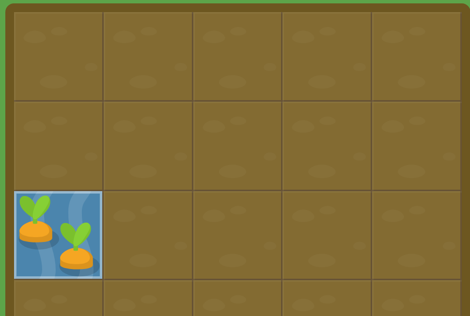
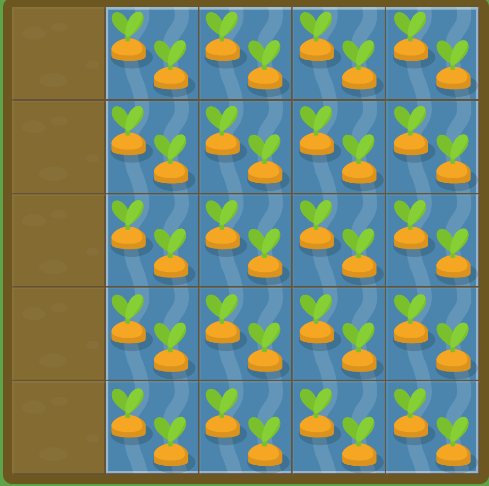
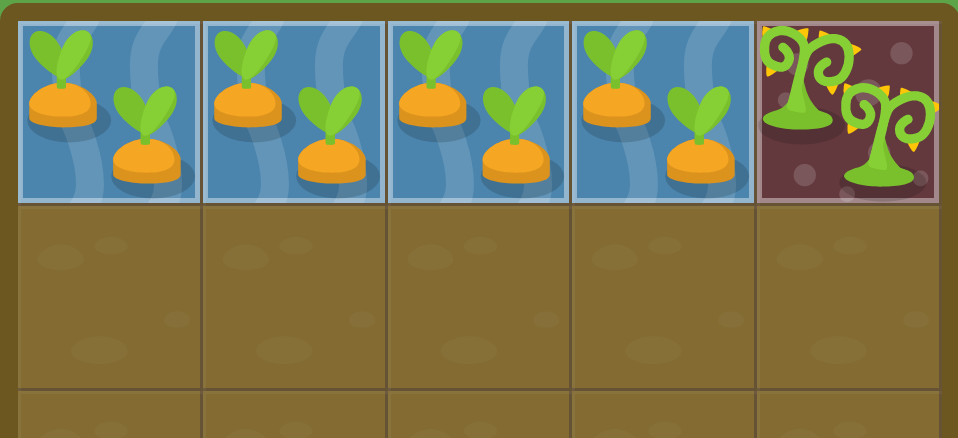
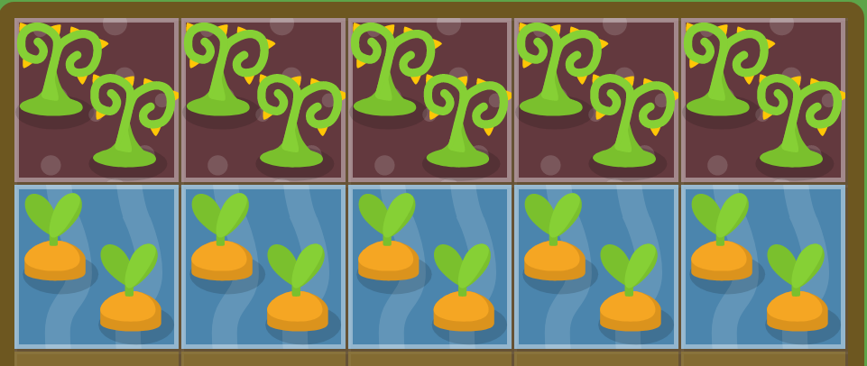

# Grid Box Notes
A simple breakdown of some grid garden


## Columns

``` css
#water {
  grid-column-start: 3;
}
 This means that the water will start at the 3rd vertical grid line, Which is another way of saying the 3rd vertical border from the left of the grid. 
```


You can see above how water started from the 3rd vertical line

``` css
#water {
grid-column-start: 1;
grid-column-end: 4;

}
When grid-column-start is used alone, the grid item by default will span exactly one column. However, you can expand the item across multiple columns by adding the grid-column-end property

grid-column-end will end at the vertical line that you set it to
```


```css
#water {
  grid-column-start: 5;
  grid-column-end: 2;
}

When using start and end, the end value doesn't have to be greater than the start value

```

#### You can also do negatives

If you want to count grid lines from the right instead of the left, you can give grid-column-start and grid-column-end negative values. 

E.g. -1 is the frist grid line from the right

``` css
#water {
  grid-column-start: 1;
  grid-column-end: -3;
}

look above and from the farthest right thats -1 then count two more and thats -3 
```


#### Anotehr example

``` css 
#water {
  grid-column-start: -3
}
It still goes from left to right rmr that
```


### Span

Instead of defining a grid item bated on the start and end positions of the grid lines, we can define it based on the desired column width using the span keyword. **only works with positive values**


``` css 
#water {
  grid-column-start: 2;
  grid-column-end: span 2;
}
```


You can also set the span keyword with grid-column-start to set your item's width relative to the end position

``` css 
#water {
  grid-column-start: span 3;
  grid-column-end: 6;
}
This starts the water at the 6th line and spans to the left 3 blocks

```


### Short forms for grid-column-start and grid-column-end

Typing both of them again is hard so we have a short form

E.g. grid-column: 2 / 4 ; Will set the grid item to start on the second vertical line and end on the 4th grid line

``` css 
#water {
  grid-column: 3/6 
}
Refer to the above picture to see the same code implementation 
```


#### You can also combine span inside of this


E.g. 

``` css 
#water {
  grid-column: 3 / span 3;
}
This is again the same as the above picture
```

---

## Grid Row

Gridbox is better than flexbox cause u can set it to the two dimensions like columns and rows

grid-row-start works the same as grid-column-start except along the vertical axis


``` css
#water {
  grid-row-start: 3
}
You can see how we start at the third line going down, just like in columns we go from left to right
```



#### The same short hand can be used


``` css
#water {
  grid-row: 3 /6 
}
Starts on the third line and goes down to the 6th line ... Not shown cause its like column but vertical now
```


---


## Using Row and Column at the same time


Lets look at an advanced example


using grid-column and grid-row


``` css
#water {
  grid-column: 2 / span 4;
  grid-row: 1 / span 5;
}
Column Starts at the second vertical line, spanning 4 blocks including the first one 
Row starts at the First horizontal line, spanning 5 blocks down including the one its on
```

Analyze this to understand it





### grid-area


We can combine grid-column and grid-row into one

grid-area accecpts both 


grid-row-start, grid-column-start, grid-row-end, grid-column-end

``` css
#water {
  grid-area: 1 / 2 / 4 / 6;
}
```


### Overlapping

You can overlap multiple items , just use a second grid-area to define a area

``` css 
#water-1 {
  grid-area: 1 / 4 / 6 / 5;
}
#water-2 {
  grid-area: 2 / 3 / 5 / 6;
}

```


---

## Order


If grid items aren't explicitly placed with grid-area, grid-column, grid-row etc... they are automaticallly played according to their ordcer in the source code.  We can override this by using the **order** property. 

By default, all grid items have an order of 0, but this can be set to any positive or negative value. similar to z-index

In the below example
The carrots in the second column are being poisoned and the weeds in the last column are being watered. 

we change the order of the poison to fix this

``` css
.water {
  order: 0;
}

#poison {
  order: 1;
}
```




This next example will explain it a bit better
look at the position of the weeds and -1 value associated with it. see how its first and then the carrots come after so we need to give poison a value of -1 cause its comes before 0 

 
 ``` css
.water {
  order: 0;
}

.poison {
  order: -1
}

 ```

 


 ---

 ## Setting Up the Grid

 up to this whole point we did 5 columns, each with a full width of 20%, and 5 rows with a 20% full height

 This was done with the following code

 ``` css
#garden {
  display: grid;
  grid-template-columns: 20% 20% 20% 20% 20%;
  grid-template-rows: 20% 20% 20% 20% 20%; 
}
You can setup the grid however you want. 
 ```

If things get tedius then we can setup the grid using the **repeat** function


``` css
#garden {
  display: grid;
  grid-template-columns: repeat(5, 20%);
  grid-template-rows: 20% 20% 20% 20% 20%;
}

```


### Different values

grid-tempate-columns doesn't just accept, values in percentages, but also length units like pixels and ems. You can mix all of these units together

``` css
#garden {
  display: grid;
  grid-template-columns: 100px 3em 40%;
  grid-template-rows: 20% 20% 20% 20% 20%;
}
```

---

## Special Unit Fractional **fr**


Grid also intr


